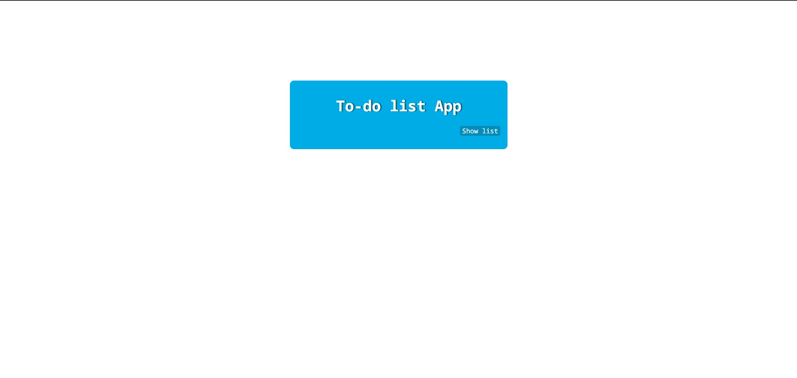
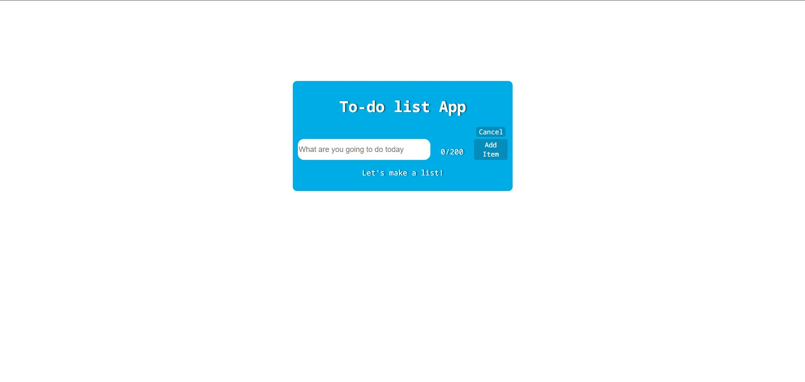
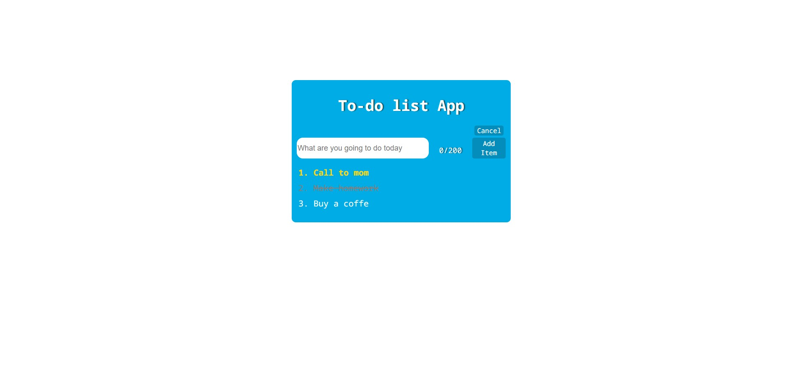

# To-do-list-app
Task: Create an app on based vueschool.io's courses.<br>
There's a simple app about to-do list. You can add your plan on a day, if you click LBM you will cross out your record, if you click RBM you will make it high priority.
To start you need to click "Show list", also ypu can hide it by clicking "Cancel"<br>
# index.html
```
<!DOCTYPE html>
<html lang="en">
<head>
    <meta charset="UTF-8">
    <meta name="viewport" content="width=device-width, initial-scale=1.0">
    <link href="main.css" rel="stylesheet">
    <style>
        @import url('https://fonts.googleapis.com/css2?family=Noto+Sans+Mono:wght@100..900&display=swap');
    </style>
    <title>To-do list</title>
</head>
<body>
    <div id="to-do-list">
        <h1>{{header || 'Welcome'}}</h1>
        <div class="show-form">
            <button v-if="editing" @click="Edit(false)" class="close">Cancel</button>
            <button v-else @click="Edit(true)" class="show">Show list</button>
        </div>
        <div v-if="editing" class="add-item-form">
            <input @keyup.enter="AddItem" v-model="newItem" type="text" placeholder="What are you going to do today">
            <p class="counter">{{Count}}/200</p>
            <button :disabled="newItem.length === 0 || newItem.length > 200" @click="AddItem" class="add-item-btn">Add Item</button>
        </div>
        <p v-if="items.length === 0 && editing">Let's make a list!</p>
        <ul class="list-of-items" oncontextmenu="return false;">
            <li v-for="item in ReversedItems" :key="item.id"
            @click="DoneItem(item)"
            @click.right="PriorityItem(item)"
            :class="{done_item: item.isDone, priority_item: item.priority}"
            >{{item.label}}
            </li>
        </ul>
    </div>

    <script src="https://unpkg.com/vue@3"></script>

    <script>
        Vue.createApp({
            data(){
                return {
                    header: "To-do list App",
                    newItem:'',
                    editing: false,
                    items: []
                }
            },
            computed:{
                Count(){
                    return this.newItem.length
                },
                ReversedItems(){
                    return [...this.items].reverse()
                }
            },
            methods:{
                AddItem(){
                    this.items.push({id: this.items.length + 1, label: this.newItem,
                        isDone: false, priority: false})
                    this.newItem = ''
                },
                Edit(editing){
                    this.editing = editing
                },
                DoneItem(item){
                    item.isDone = !item.isDone
                },
                PriorityItem(item){
                    item.priority = !item.priority
                }
            }
        })
        .mount('#to-do-list')
    </script>
</body>
</html>
```
# main.css
```
html, body {
    height: 100%;
    margin: 0;
    padding: 0;

}

body{
    font-family: "Noto Sans Mono", serif;
    color: white;
    text-shadow: 3px 0px 2px rgba(0, 0, 0, 0.521);
    font-size: large;
    display: flex;
    justify-content: center;
    align-items: flex-start;
}

#to-do-list{
    background-color: #00ace6;
    text-align: center;
    margin-top: 10%;
    padding: 12px;
    border-radius: 10px;
    border-color: #00759c;
    width: 500px;
}

button{
    font-family: "Noto Sans Mono", serif;
    font-size: medium;
    color: white;
    background-color: #048dbb;
    border-radius: 5px;
    border: none;
}

.show-form{
    display: flex;
    justify-content: right;
    align-items: flex-start;
    margin: 5px;
}

.add-item-form{
    display: flex;
    gap: 5%;
    height: 50px;
    overflow: hidden;
}

.add-item-form input{
    font-size: large;
    width: 70%;
    border-radius: 15px;
    border: none;
}

.list-of-items{
    list-style: decimal;
    text-align: left;
    text-shadow: none;
    font-size: 20px;
}

li{
    overflow-wrap: break-word;
    margin-bottom: 10px;
}

.done_item{
    text-decoration: line-through;
    color: gray;
}

.priority_item{
    font-size: 16;
    color: gold;
    font-weight: bold;
}
```
# Some screenshots



